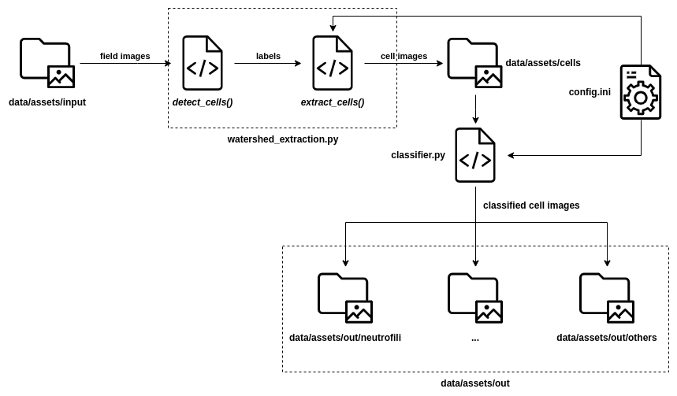

# pyRinocitologia

Central repository for Rinocitologia project developed as an undergraduate thesis.
The purpose of this repository is to contains all development code allowing...


## Design Philosophy
* Reproducibility
* Process automation
* Explicit is better than implicit
* Infrastructure built around data
* Prefer cross-platform solution


## Directory Structure

```

.
|
+--- data                       data used by code 
|   
+--- models                     pre-trained models and stored weights
|    
+--- notebooks                  jupyter notebooks for analisys and experiments
|    
+--- report                     resources used for documentation 
|    
+--- src                        main code
|    
+--- tools                      code for misc utilities
|    
+--- config.ini.example         configuration file  
|     
+--- README.md
|     
+--- requirements.txt           python pip dependencies file
```

## Setup
* Create a virtual environment with *conda* or *virtualenv* (optional but recommended)

* Install dependencies:
>pip install -r requirements.txt

* Setup the environment with *config.ini*, rename *config.ini.example* into *config.ini* and change content to adapt to your environment

## Use
You can use your custom data or use our [Open Data Dataset](https://github.com/PRFina/Rinocitologia-Dataset). dataset/s could be clone directly in the main repository.


## Data Gathering 


#### Data Gathering Workflow


#### Execution Flow

### Tools
Various utilities script has been developed. 

* *metadata_generator.py* 
is a small command line utility to help in generate a dataset metadata json file. for more info:
```bash
python metadata_generator.py --help
```

###### note:
image annotation tool : [VGG Image Annotation (VIA)](http://www.robots.ox.ac.uk/~vgg/software/via/)

### Warnings
 The python interpreter cwd (Current Working Directory)
 must be set to the **root directory**/parent directory of __/src__ folder 
 eg:
 ```python
import os
os.chdir("..")
```
or equivalently, call python interpreter from the parent directory:
 ```bash
python <parent dir>/src <script name>
```
or add to [PYTHONPATH](https://docs.python.org/3.6/using/cmdline.html#environment-variables) the parent directory:
 ```bash
export PYTHONPATH=<root directory>
python <script name>
```


(if you use pyCharm IDE this is done automatically in run configuration)

----

